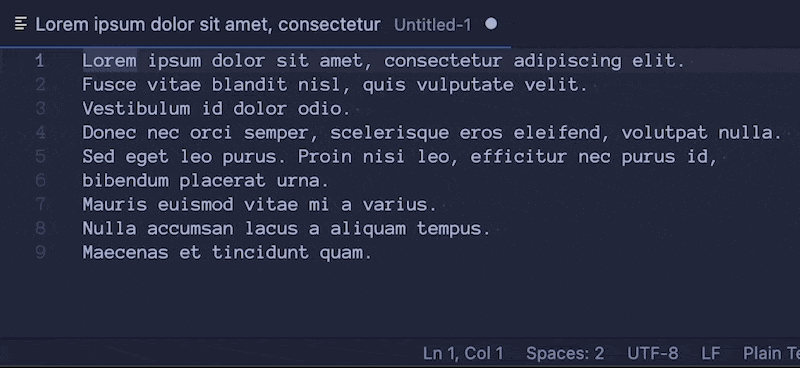

# better-status-bar

Better Status Bar is a tiny extension which adds a new item in the statusbar which counts the number of lines of code in your selection.

It also supports multiple cursors with multiple selections, adding them all together.

You can then hide the built-in statusbar by right-clicking on the statusbar and deselecting `Editor Selection`.

## Example



## Release Notes

### 1.0.0

Initial release.

## Local Development

1. Install NodeJS:

    ```
    brew install nodejs
    ```

2. Install the project dependencies:

    ```
    npm install package.json
    ```

3. Open this repository in VS Code and choose `Run -> Start Debugging` or press `F5`.
